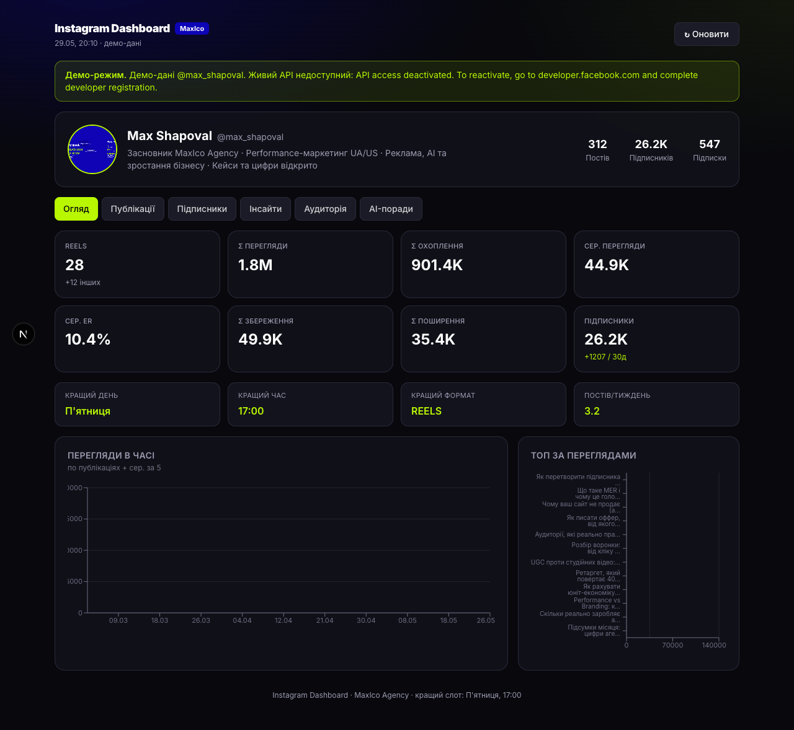

<!-- LANG -->
**🇬🇧 English** · [🇺🇦 Українською](README.uk.md)

# Instagram Dashboard

A self-hosted **Instagram analytics dashboard with AI** — Reels performance, reach, engagement, follower growth, audience demographics, **Whisper transcripts**, speech-pattern analysis, and an **AI script generator** that writes in your own style. Admin login included. Built by **[MaxICo Labs](https://maxicolabs.com/)**.

🔗 **Live demo:** https://inst-dashbord.maxicolabs.com



## What it shows

| Tab | Content |
|---|---|
| **Огляд (Overview)** | KPIs with **period selector (7 / 30 / 90 days / all) and comparison vs the previous period**, best day/time/format, views trend, top posts (clickable) |
| **Публікації (Posts)** | Full table: search, type filter, sorting, view bars, ER% badges, links to posts |
| **Підписники (Followers)** | Daily growth with reel markers, views→gain correlation |
| **Інсайти (Insights)** | By weekday, monthly trend, saves vs shares, distribution, top by ER% |
| **Паттерни (Patterns)** | From Whisper transcripts: script length vs views, question-in-hook, casualness, magnet/save words |
| **Скрипти (Scripts)** | Per-reel transcripts |
| **Генератор (Generator)** | AI writes a Reel script in **your** style from your top transcripts + patterns |
| **Аудиторія (Audience)** | Real demographics: gender, age, country, city |
| **AI-поради** | LLM recommendations from your metrics |

## Tech / format

Next.js 16 (App Router, TypeScript) · Tailwind CSS v4 · Recharts · OpenAI (chat + Whisper) · file persistence on a Docker volume. No external database.

## Quick start (local)

```bash
git clone https://github.com/MaxICo-Agency/instagram-dashboard.git
cd instagram-dashboard
pnpm install                 # or npm install
cp .env.example .env.local   # fill in (see below)
pnpm dev                     # → http://localhost:3000
```

First screen is the **admin login** (credentials from `.env.local`). Then either real data (if a token is set) or a connect screen.

## Configuration

Set these in `.env.local` (local) / `.env` (server) — **or add them later from the in-app ⚙ Settings → API keys** (saved on the server, no redeploy):

```env
# Admin login
ADMIN_USERNAME=admin
ADMIN_PASSWORD=your_password
AUTH_SECRET=random_string            # openssl rand -hex 32

# Instagram API
IG_ACCESS_TOKEN=                     # token with instagram_business_manage_insights
IG_USER_ID=me                        # or the ig-business-account-id
IG_API_HOST=https://graph.instagram.com
IG_OWNER_HANDLE=your_handle          # used for the footer UTM
IG_REQUIRE_LIVE=1                    # production: never show demo data

# OpenAI (AI recommendations, script generator, Whisper transcripts)
OPENAI_API_KEY=
OPENAI_MODEL=gpt-4.1
```

> **You can manage the Instagram token and OpenAI key entirely from the UI** — open **⚙ Settings**, paste them, hit **Save**. They persist to the server's data volume.

### How to get the Instagram token
Full picture guide: **[`docs/Instagram-Dashboard-Інструкція.pdf`](docs/Instagram-Dashboard-%D0%86%D0%BD%D1%81%D1%82%D1%80%D1%83%D0%BA%D1%86%D1%96%D1%8F.pdf)**.
In short: a **Business/Creator** account linked to a Meta app → use case **“Manage messaging & content on Instagram”** → add permission `instagram_business_manage_insights` → generate an access token.

### AI features (Whisper / Generator)
Need a funded `OPENAI_API_KEY`. In **⚙ Settings → “Transcribe reels”** the app downloads each reel and transcribes it via OpenAI Whisper (stored on the data volume). After that, **Patterns**, **Scripts** and the **Generator** are powered by your real transcripts.

## Deploy (Docker + Traefik)

```bash
git clone https://github.com/MaxICo-Agency/instagram-dashboard.git /opt/instagram-dashboard
cd /opt/instagram-dashboard
cp .env.example .env && nano .env     # ADMIN_*, AUTH_SECRET, IG_*, OPENAI_*, IG_REQUIRE_LIVE=1
docker compose up -d --build
```

`docker-compose.yml` ships Traefik labels for `inst-dashbord.maxicolabs.com` (HTTPS via Let's Encrypt) and a named volume `data` (`/app/data`) for transcripts + saved config. Point your subdomain's DNS A-record at the server first; change the `Host(...)` label for your own domain.

## Security

- Every page and every `/api/*` route is behind **admin login** (signed cookie). Unauthenticated requests are redirected / return 401.
- Secrets live only in `.env`/`.env.local` or the server data volume — **never committed** (`.gitignore` + a build guard).
- `noindex` on all pages. Build runs `next build --webpack` (Turbopack panics on non-ASCII paths).

## Notes

- Data is cached 10 min; **Оновити** (or `POST /api/refresh`) busts it.
- The **MaxICo Labs** footer is required on every page (a build guard fails the build if removed).

---

<sub>Built by **[MaxICo Labs](https://maxicolabs.com/)** · performance marketing UA/US · need a custom build? `all@maxico.agency`</sub>
