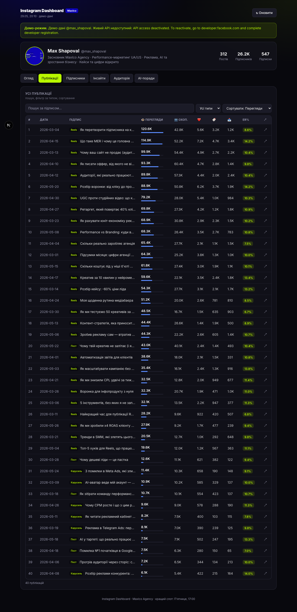

# Instagram Dashboard

**Аналітика Instagram + AI-рекомендації українською.** Reels, охоплення, залученість, приріст підписників, аудиторія та поради — в одному дашборді з адмін-входом. Зроблено в **[MaxICo Labs](https://maxicolabs.com/)**.

🔗 **Демо/прод:** https://inst-dashbord.maxicolabs.com


---

## 🤖 Для AI-агента (найшвидший шлях)

Якщо ти запускаєш це через AI-агента (Claude, Cursor тощо) — **відкрий [`AGENTS.md`](AGENTS.md)**. Там покроковий онбординг: агент сам спитає «локально чи на сервер», встановить залежності, допоможе отримати токен і запустить. Людині достатньо віддати агенту цю папку і пройти інструкції.

---

## Що показує

| Вкладка | Вміст |
|---|---|
| **Огляд** | 8 KPI (Reels, Σ переглядів/охоплення, сер. перегляди, ER%, збереження, поширення, підписники), кращий день/час/формат, графік переглядів + ковзне середнє, топ за переглядами |
| **Публікації** | Повна таблиця: пошук, фільтр за типом, сортування, мінібари переглядів, кольорові бейджі ER% |
| **Підписники** | Приріст із відмітками днів Reels, кореляція «перегляди → приріст» |
| **Інсайти** | За днем тижня, місячна динаміка, збереження vs поширення, розподіл, топ за ER%, найкращі за збереженнями/поширеннями |
| **Аудиторія** | Стать, вік, країни, міста |
| **AI-поради** | OpenAI `gpt-4.1` аналізує метрики й пише рекомендації українською |



---

## Швидкий старт (локально)

```bash
git clone <repo-url> instagram-dashboard
cd instagram-dashboard
pnpm install                 # або npm install
cp .env.example .env.local   # заповни (див. нижче)
pnpm dev                     # → http://localhost:3000
```

Перший екран — **вхід** (логін/пароль із `.env.local`). Далі: якщо токен не задано і `IG_REQUIRE_LIVE` порожній — показуються демо-дані; якщо `IG_REQUIRE_LIVE=1` — екран підключення.

## Конфігурація `.env.local`

```env
# Адмін-вхід
ADMIN_USERNAME=admin
ADMIN_PASSWORD=ваш_пароль
AUTH_SECRET=випадковий_рядок        # openssl rand -hex 32

# Instagram API
IG_ACCESS_TOKEN=                     # токен зі scope insights
IG_USER_ID=                          # me (IG-Login) або ig-business-account-id (FB-Login)
IG_API_HOST=https://graph.instagram.com
IG_GRAPH_VERSION=v21.0
IG_OWNER_HANDLE=ваш_нік              # для UTM у футтері
IG_REQUIRE_LIVE=1                    # у проді — без демо

# OpenAI (AI-поради)
OPENAI_API_KEY=
OPENAI_MODEL=gpt-4.1
```

### Як отримати `IG_ACCESS_TOKEN`
Повна інструкція зі скриншотами — **[`docs/Instagram-Dashboard-Інструкція.pdf`](docs/Instagram-Dashboard-Інструкція.pdf)**.
Коротко: акаунт має бути **Business/Creator** + прив'язаний до Facebook Page → на `developers.facebook.com` створи/активуй застосунок → додай дозволи `instagram_business_basic`, `instagram_business_manage_insights` → у **Graph API Explorer** згенеруй токен.

### AI-рекомендації
Потрібен власний `OPENAI_API_KEY` (отримати на **platform.openai.com**). Без нього поради формуються офлайн (на правилах).

---

## Деплой на сервер (Docker + Traefik)

```bash
# на сервері з Traefik (мережа maxico-platform_public, resolver "le"):
git clone <repo-url> /opt/instagram-dashboard && cd /opt/instagram-dashboard
cp .env.example .env && nano .env       # задай ADMIN_*, AUTH_SECRET, IG_*, OPENAI_*, IG_REQUIRE_LIVE=1
docker compose up -d --build
```

`docker-compose.yml` уже містить Traefik-лейбли для `inst-dashbord.maxicolabs.com` (HTTPS + Let's Encrypt). Перед `up` переконайся, що **DNS A-запис субдомену вказує на сервер**. Свій домен — заміни Host(...) у `docker-compose.yml`.

---

## Примітки

- `dev`/`build` використовують **webpack** (Turbopack падає на шляхах із не-ASCII символами). На латиничному шляху можна `next dev --turbopack`.
- У Docker запінено **pnpm 9** (pnpm 10 блокує свіжі транзитивні залежності supply-chain політикою).
- Кеш даних — 10 хв; кнопка **«Оновити»** скидає.
- Секрети — лише в `.env.local`/`.env`, у git не потрапляють.
- Футтер «Створено MaxICo Labs» — обов'язкова частина продукту (build-guard стежить за наявністю).

---

<sub>Створено **[MaxICo Labs](https://maxicolabs.com/)** · performance-маркетинг UA/US · можемо розробити індивідуальне рішення — `all@maxico.agency`</sub>
